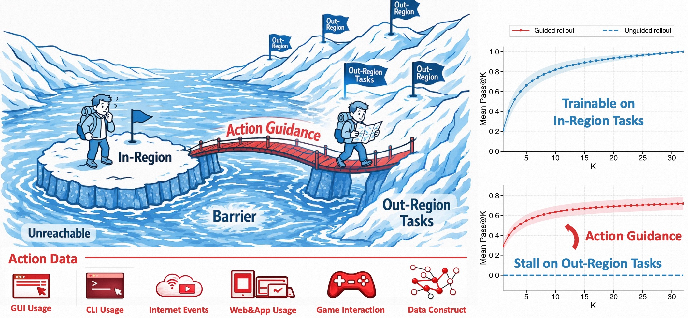

<h1 align="center" style="margin-top: 10px;">Learning Agentic Policy from Action Guidance</h1>

<p align="center">
  <a href="https://yuxiang-ji.com/">Yuxiang Ji</a><sup>1,2*</sup>,
  Zengbin Wang<sup>2*</sup>,
  Yong Wang<sup>2†</sup>,
  Shidong Yang<sup>2</sup>,
  Ziyu Ma<sup>2</sup>,
  Guanhua Chen<sup>3</sup>,
  Zonghua Sun<sup>1</sup>,
  Liaoni Wu<sup>1</sup>,
  Xiangxiang Chu<sup>2</sup>
  <br>
  <sup>1</sup>Xiamen University &nbsp;&nbsp;
  <sup>2</sup>AMAP, Alibaba Group &nbsp;&nbsp;
  <sup>3</sup>Southern University of Science and Technology
  <br>
  <sup>*</sup>Equal contribution,
  <sup>†</sup>Project lead. &nbsp;&nbsp;&nbsp;
</p>

<div align="center">

[](https://arxiv.org/abs/2605.12004)

</div>

## News

- [May 12, 2026]: Codebase released. (work in progress)

## Table of contents

- [Overview](#overview)
- [Quick start](#quick-start)
- [Acknowledgement](#acknowledgement)
- [Citation](#citation)

## Overview

Agentic reinforcement learning (RL) for LLMs critically depends on the exploration capability of the base policy: when reward states are beyond its reachable region, advantage estimates can collapse and training may stall. Instead of relying on costly supervised cold starts, we study how to use readily available action trajectories as plan-style guidance to help agents reach useful states during RL.

<p align="center">
  
  <i>
  The overview of ActGuide-RL.
  </i>
</p>

We propose **ActGuide-RL**, which injects action data as adaptive reference guidance and jointly optimizes guided and unguided rollouts, internalizing the exploration gains back into the unguided policy. On search-agent benchmarks, ActGuide-RL consistently improves over vanilla RL and can approach SFT+RL performance without requiring supervised warm-start data.

## Quick start


### Installation

```bash
conda create -n actguide python=3.12 -y
conda activate actguide
pip install -e .
pip install swanlab
```

### Data preparation

```bash
export DATA_DIR=/path/to/data/deepsearch
cd examples/data_preprocess
bash preprocess_deepresearch_actguide.sh
```

### Tool and reward servers

Launch the DeepResearch tool server:

```bash
export SERPER_API_KEY=your_serper_key
bash tool_server/run_deepresearch_api_server.sh 0
```

Launch one or more OpenAI-compatible reward judge servers. For example, with vLLM:

```bash
CUDA_VISIBLE_DEVICES=0 vllm serve /path/to/judge-model --host 0.0.0.0 --port 7011 --disable-log-requests
```

If you run multiple reward servers or need a single external port, use the proxy. By default it maps
`/reward1/`, `/reward2/`, ... to local ports `7011`, `7012`, ...:

```bash
cd searchagent_scripts/proxy
python run_proxy.py
```


### RL training

Run the ActGuide recipe:

```bash
bash searchagent_scripts/train_searchagent_actguide.sh
```

### Evaluation

```bash
bash searchagent_scripts/test_searchagent.sh
```

## Citation

```bibtex
Coming soon.
```
